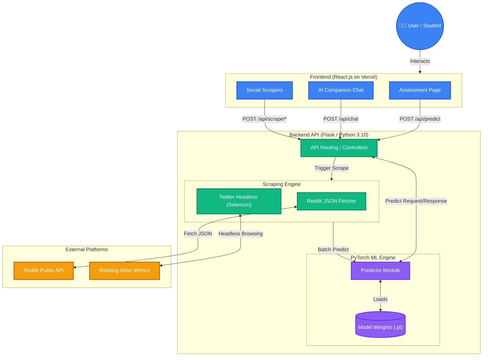
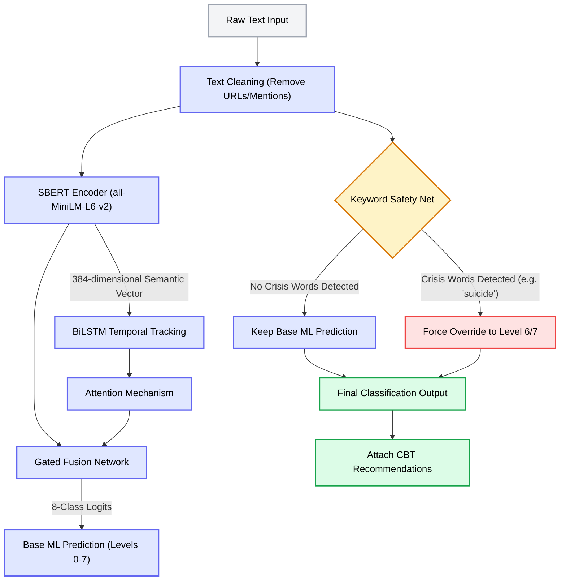
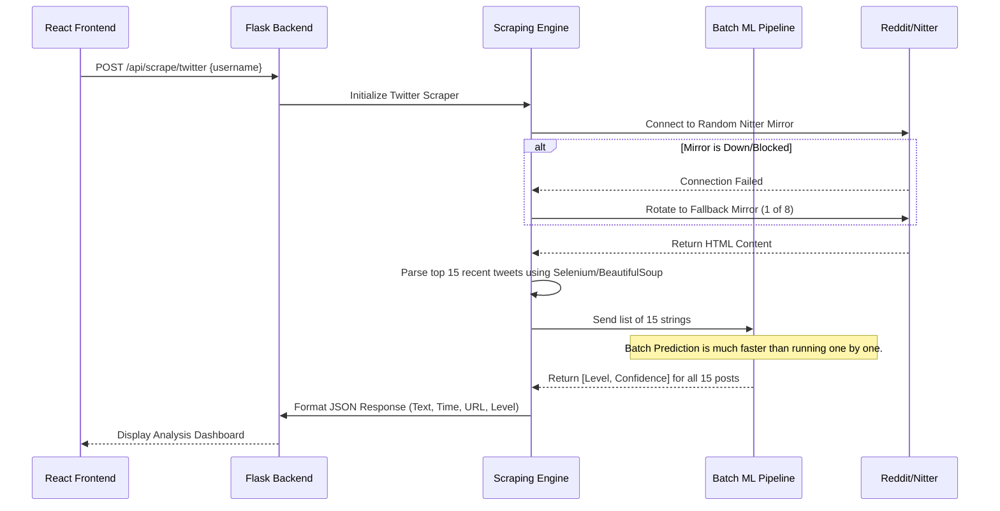
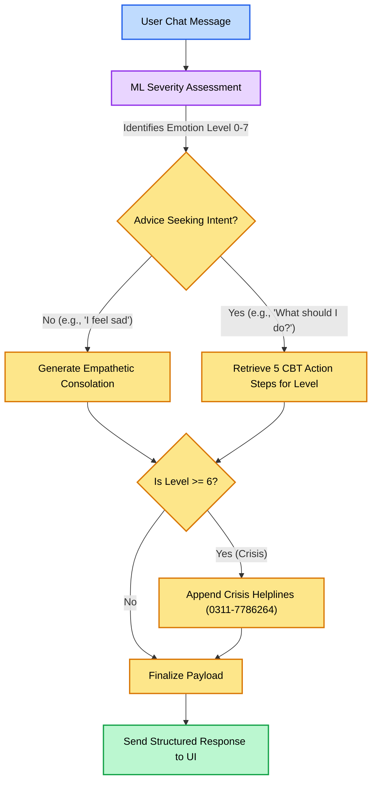

# MindCare System Architecture & Pipelines

This document contains the structural diagrams for the MindCare AI platform. You can use these diagrams for your Final Year Project (FYP) report, presentation, or to answer committee questions regarding data flow and system design. You can view these diagrams by pasting the code blocks into [Mermaid Live Editor](https://mermaid.live).

## 1. High-Level System Architecture

This diagram shows how the entire system connects together, from the user interface down to the backend machine learning models.

---

## 2. Core Machine Learning Pipeline (SBERT + BiLSTM)

This is the exact data flow for how a piece of text is processed and classified into an emotional severity level. This is crucial for defending your 87.4% accuracy claim.

---

## 3. Social Media Intelligence (Scraper Flow)

How the system analyzes a user's digital footprint across platforms without using paid API keys.

---

## 4. AI Companion Chatbot Flow

How the chatbot recognizes intent and provides Cognitive Behavioral Therapy (CBT) advice dynamically.

